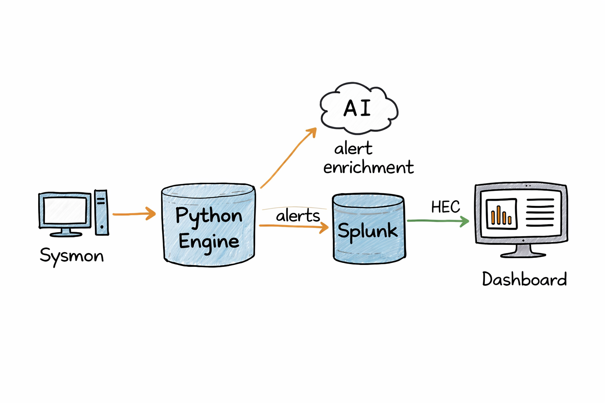
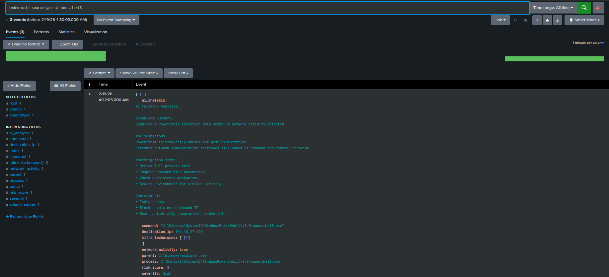
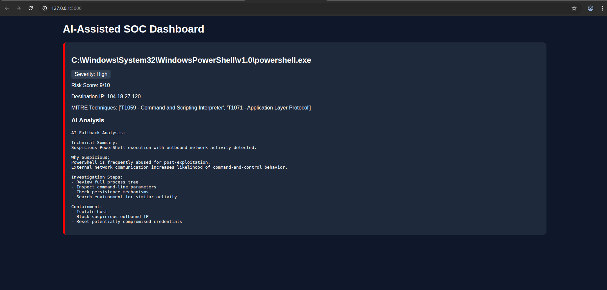

# AI-SOC-Triage-Engine

An AI-assisted Security Operations Center (SOC) triage engine that ingests Sysmon telemetry, performs behavioral correlation and risk scoring, maps detections to MITRE ATT&CK, enriches alerts using LLM-based analysis, and forwards structured events to Splunk via HTTP Event Collector (HEC).

This project simulates a real-world SOC detection and response workflow.

---

## 🎯 Project Objective

To design and implement a lightweight SOC automation pipeline that demonstrates:

- Endpoint telemetry parsing
- Behavioral detection engineering
- Risk-based alert prioritization
- MITRE ATT&CK mapping
- AI-assisted investigation guidance
- SIEM (Splunk) integration via API

---

## 🏗 Architecture

Sysmon → Python Detection Engine → AI Enrichment → Splunk (HEC) → SOC Dashboard

---

## 🔎 Detection Capabilities

### Behavioral Correlation
- Process creation (Sysmon Event ID 1)
- Network connections (Sysmon Event ID 3)
- Parent-child process relationships

### Risk Scoring Model

Weighted scoring based on:

- PowerShell execution
- Outbound network activity
- External IP communication
- Suspicious parent process (e.g., winword.exe)
- Encoded or obfuscated PowerShell flags

Severity Levels:
- Medium (Risk Score ≥ 7)
- High (Risk Score ≥ 9)

---

## 🧠 MITRE ATT&CK Mapping

Automatically tags alerts with relevant techniques:

- T1059 – Command and Scripting Interpreter
- T1071 – Application Layer Protocol
- T1204 – User Execution

---

## 🤖 AI Alert Enrichment

Each alert is enriched with structured SOC analysis including:

- Technical summary
- Suspicion reasoning
- Investigation steps
- Containment recommendations

If the AI service is unavailable, a built-in fallback analysis ensures operational continuity.

---

## 📊 Splunk Integration

Alerts are forwarded to Splunk using HTTP Event Collector (HEC) as structured JSON events.

Search in Splunk:
index=main sourcetype=ai_soc_alert

---

## 🖥 AI-Assisted SOC Dashboard

The Flask-based dashboard displays:

- Process details
- Risk score
- Severity level
- MITRE techniques
- AI-generated investigation guidance

---

## ⚙ Tech Stack

- Python
- Flask
- Sysmon
- Splunk Enterprise
- HTTP Event Collector (HEC)
- OpenAI API
- MITRE ATT&CK Framework

---

## 🔐 Security Considerations

- API keys and HEC tokens are handled using environment variables
- No credentials are stored in the repository
- Designed for secure lab simulation purposes

---

## 🚀 Future Enhancements

- Multi-host correlation
- Persistence detection (Registry / Scheduled Tasks)
- YARA rule integration
- Splunk dashboard visualizations
- Alert deduplication logic
- Threat intelligence feed ingestion

---

## 👤 Author

Built as part of a hands-on cybersecurity journey focused on SOC operations, detection engineering, and real-world blue team workflows.

